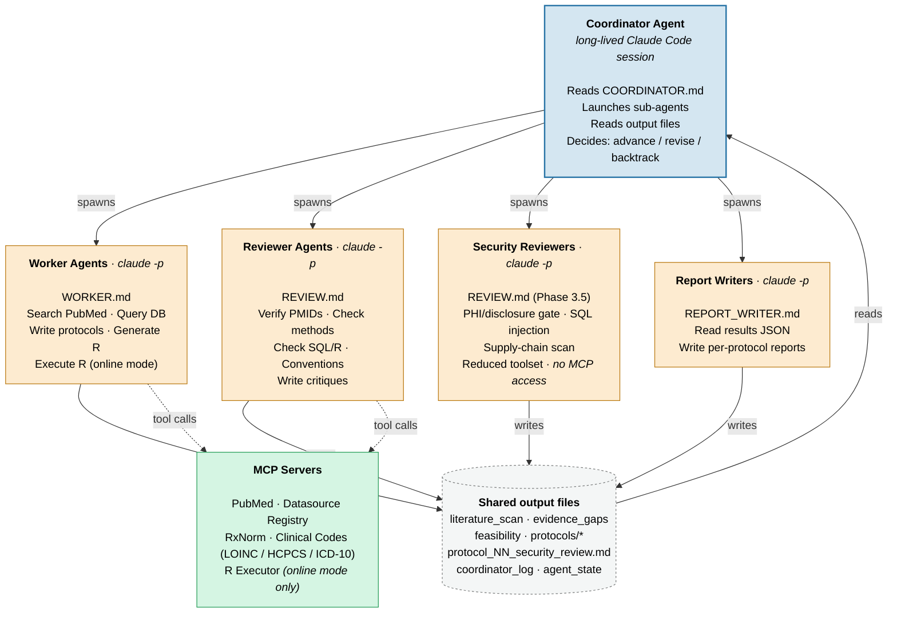

# Auto-Protocol Designer (AutoTTE)

**From a therapeutic area to a reviewed, runnable causal-inference protocol — without writing the boilerplate.**

AutoTTE is an autonomous multi-agent system that surveys the clinical
literature for unresolved causal questions and produces rigorous **target
trial emulation** protocols to answer them — complete with runnable R
analysis code, an independent peer-review loop, and optional execution
against a configured real-world database. The coordinator agent drives the
whole pipeline with its own judgment, the way a PI directs a team of
postdocs. After the protocol(s) run against your database, AutoTTE writes a
report for each protocol along with an overall summary of all protocols.

## Why researchers use AutoTTE

- **Built around the Hernán & Robins target trial framework.** Every
  protocol specifies the target trial components — eligibility, treatment
  strategies, assignment, time zero, follow-up, outcomes, and causal
  contrasts — with explicit checks for the failure modes that sink most
  observational studies: immortal time bias, prevalent-user bias,
  time-varying confounding, and post-baseline selection.
- **Independent peer review, baked in.** Reviewer agents run in fresh
  Claude Code sessions and see only the worker's output files, never its
  reasoning — so they cannot be anchored into agreement. Protocols, SQL,
  and R code face the same scrutiny a journal peer reviewer would apply,
  on every revision.
- **Works with your data, wherever it lives.** *Online* mode lets agents
  query a live database, validate cohort sizes, and execute analyses
  end-to-end. *Offline* mode produces the same protocols and R scripts
  from a schema dump and data profile alone — designed for firewalled
  institutional CDWs, IRB-restricted environments, and enclave data
  (MIMIC-IV, PhysioNet) where the LLM can never see a row.
- **Multiple CDMs, out of the box.** First-class support for **PCORnet**,
  **OMOP**, **MIMIC-IV**, and **NHANES**, plus deterministic Quarto
  profiling templates so every site produces comparable, reproducible
  data profiles that don't drift with the LLM.
- **Cross-database replication for free.** Point a single run at multiple
  databases and AutoTTE branches feasibility, protocol generation, and
  execution per DB, then synthesizes a side-by-side comparison of effect
  estimates — a natural replication signal that strengthens causal
  inference.
- **Transparent and auditable.** Every coordinator decision is logged and
  every state transition is captured as JSON — a full audit trail
  suitable for reproducibility sections, pre-registration, and regulatory
  review.
- **Database conventions as a first-class concept.** Each configured
  database carries a conventions file documenting its SQL-dialect quirks,
  legacy-data caveats, and known quality issues, which every agent reads
  and applies before writing a single query.

## Architecture



**No hardcoded state machine.** The coordinator agent decides when work is
good enough to advance, when it needs revision, and when to backtrack. It
evaluates sub-agent output against objective acceptance criteria defined in
COORDINATOR.md, but the judgment and routing are the agent's own.

**Independent review.** Every reviewer runs in a fresh Claude Code session
with no access to the worker's reasoning -- only the output files. This
prevents anchoring and enables genuine error detection.

## How It Works

The coordinator runs as a long-lived Claude Code session. It launches
sub-agents (workers, reviewers, and report writers) by calling `claude -p`
in bash, reads their output files, and decides what to do next.

### Pipeline Phases

**Phase 0 -- Data Source Onboarding** (for each selected database)
Auto-generates schema dump and data profile for any DB marked
`RUN_AUTO_ONBOARD` in `db_triage.json`. In online mode the coordinator uses
`dump_schema(db_id=…)` and `run_profiler(db_id=…, code=…)` from the R executor
MCP server. In offline mode the schema dump and profile must already exist
on disk; DBs missing them are skipped at startup. For deterministic,
reproducible profiles (whether online or offline), `profilers/<cdm>.qmd`
ships per-CDM Quarto templates (PCORnet, OMOP, MIMIC) you can render
directly — see [Adding a New Database](#adding-a-new-database).

**Phase 1 -- Literature Discovery**
Worker searches PubMed using a three-pass strategy (broad landscape, targeted
per-question, citation chaining), extracts PICO questions, and identifies
evidence gaps. Reviewer verifies PMIDs, runs independent searches, and
stress-tests "no prior studies" claims.

**Phase 2 -- Feasibility Assessment**
Worker checks whether the configured database (or public datasets) can
support each question, using the data profile for realistic sample size
estimates and variable availability. In online mode, workers can query the
live database to validate feasibility assumptions.

**Phase 3 -- Protocol Generation & Review**
Worker writes full target trial emulation protocols with runnable R analysis
scripts. Reviewer checks methods, code correctness, database conventions
compliance, and statistical pitfalls.

**Phase 3.5 -- Security & Disclosure Review**
One security-reviewer sub-agent per accepted protocol runs in parallel with
a reduced toolset (`Read, Write, Edit, Bash` only — no MCP, no database
access). Each enforces three gates: the PHI/disclosure check (every output
DataFrame must flow through `disclosure_check()` with a small-cell `k`
threshold before rendering or saving), SQL-injection review (parameterized
queries only; no string-concatenated user input), and supply-chain scan (no
`install.packages` / `remotes` / `devtools` / `pak` / `renv` calls in the
script). Findings are written to `protocol_NN_security_review.md`; an
r0 → r1 revision loop allows a single fix pass before the protocol advances.

**Phase 4 -- Execution & Reporting**
In online mode, the coordinator runs R analysis scripts against the live
database via the R executor and collects structured results
(`protocol_NN_results.json`). In offline mode, it writes a `NEXT_STEPS.md`
file so the user can execute scripts on a secure machine and return results.
A report-writing agent then produces a per-protocol analysis report
(`protocol_NN_report.md`).

**Phase 5 -- Executive Summary**
The coordinator synthesizes all protocol reports into a final `summary.md`
covering key findings across the therapeutic area.

The coordinator logs every decision to `coordinator_log.md` and tracks
state in `agent_state.json` for transparency and debugging.

## Prerequisites

```bash
# Claude Code CLI
npm install -g @anthropic-ai/claude-code

# Python dependencies for MCP servers
pip install mcp httpx lxml pyyaml

# API key (if using the Anthropic API directly)
export ANTHROPIC_API_KEY="sk-ant-..."
```

> **Using Claude Code with a subscription?** If you have a Claude Pro or Max
> subscription, Claude Code works without an API key -- just run `claude` and
> authenticate with your Anthropic account. No `ANTHROPIC_API_KEY` needed.
> Sub-agents launched via `claude -p` inherit the same subscription billing.

**For online database mode** (agents query a live database):

[R](https://cran.r-project.org/) (≥ 4.1) must be installed and available on
your `PATH`. Then open an R session and install the required packages:

```r
# Core packages
install.packages(c("DBI", "jsonlite"))

# Plus the driver for your database engine:
install.packages("duckdb")   # DuckDB
install.packages("odbc")     # MS SQL Server, PostgreSQL via ODBC
```

**For the synthetic test database** (used for development and testing):

Run in R:

```r
devtools::install_github("tjohnson250/PCORnet-CDM-Synthetic-DB")
```

## Quick Start (Public Datasets Only)

The simplest mode -- generates protocols targeting public datasets like
MIMIC-IV and NHANES. No database connection required.

```bash
./run.sh "atrial fibrillation"
```

Results appear in `results/atrial_fibrillation/`.

For targeting specific configured databases, see
[Multi-Database Runs](#multi-database-runs) below.

## Quick Start (NHANES)

To run against NHANES (National Health and Nutrition Examination Survey)
data via the `nhanesA` R package:

```bash
# Install R packages (one-time)
Rscript -e 'install.packages(c("nhanesA", "duckdb", "survey", "DBI"))'

# Run
./run.sh "type 2 diabetes" --db-config databases/nhanes.yaml
```

In online mode, agents lazy-load NHANES tables from the CDC website into an
in-memory DuckDB database and can query them via SQL. Results appear in
`results/type_2_diabetes/`.

NHANES is cross-sectional, so the strongest target trial emulation designs
use the linked mortality file for prospective follow-up. See
`databases/conventions/nhanes_conventions.md` for full design constraints.

## Quick Start (MIMIC-IV)

To run against MIMIC-IV (Medical Information Mart for Intensive Care)
data from PhysioNet:

```bash
# Prerequisites: PhysioNet credentialed access (CITI training required)
# Download MIMIC-IV v3.1 CSV files from https://physionet.org/content/mimiciv/3.1/

# Install R packages (one-time)
Rscript -e 'install.packages(c("duckdb", "DBI"))'

# Load MIMIC-IV CSVs into DuckDB (one-time)
Rscript -e '
library(DBI); library(duckdb)
con <- dbConnect(duckdb::duckdb(), "databases/data/mimic_iv.duckdb")
for (f in list.files("path/to/mimiciv/3.1/hosp", pattern="\\.csv\\.gz$", full.names=TRUE)) {
  tbl <- tools::file_path_sans_ext(tools::file_path_sans_ext(basename(f)))
  dbExecute(con, sprintf("CREATE TABLE %s AS SELECT * FROM read_csv_auto(\"%s\")", tbl, f))
}
for (f in list.files("path/to/mimiciv/3.1/icu", pattern="\\.csv\\.gz$", full.names=TRUE)) {
  tbl <- tools::file_path_sans_ext(tools::file_path_sans_ext(basename(f)))
  dbExecute(con, sprintf("CREATE TABLE %s AS SELECT * FROM read_csv_auto(\"%s\")", tbl, f))
}
dbDisconnect(con)
'

# Run
./run.sh "sepsis" --db-config databases/mimic_iv.yaml
```

MIMIC-IV provides timestamped treatments, labs, vitals, and outcomes for
~300,000 hospital admissions and ~65,000 ICU stays at Beth Israel
Deaconess Medical Center (2008-2022). It is ideal for ICU-focused target
trial emulations such as vasopressor timing, ventilation strategies, and
antibiotic initiation. See `databases/conventions/mimic_iv_conventions.md`
for date shifting rules, join key hierarchy, and recommended TTE designs.

## Quick Start (Synthetic Test Database)

To run against the bundled synthetic PCORnet database (requires R and the
`PCORnetCDMSyntheticDB` package from prerequisites above):

```bash
./run.sh "atrial fibrillation" --db-config databases/synthetic_pcornet.yaml
```

This runs in online mode -- agents query the synthetic DuckDB database,
validate cohort sizes, and execute analysis scripts end-to-end. Results
appear in `results/atrial_fibrillation/`.

## Quick Start (OMOP via OMOPSynth)

To run against a synthetic OMOP CDM database (Eunomia datasets bundled
through the [OMOPSynth](https://github.com/tjohnson250/OMOPSynth) R
package). Two materialized DuckDB files are supported out of the box:

| YAML | Source dataset | Size | Best for |
|------|----------------|------|----------|
| `databases/omop_test.yaml` | `GiBleed` | ~6 MB download | Fast iteration, CI tests |
| `databases/omop_demo.yaml` | `synthea-heart-10k` | ~800 MB download | Cardiac-themed end-to-end demos |

```bash
# One-time prerequisites
Rscript -e 'install.packages(c("DBI", "duckdb", "CDMConnector", "here"))'
Rscript -e 'devtools::install_github("tjohnson250/OMOPSynth")'

# One-time DB materialization (idempotent — safe to re-run)
Rscript -e 'source("databases/data/setup_omop.R"); setup_omop_test()'
Rscript -e 'source("databases/data/setup_omop.R"); setup_omop_demo()'

# Run AutoTTE end-to-end against the demo DB
./run.sh "atrial fibrillation" --db-config databases/omop_demo.yaml
```

The `.duckdb` files land in `databases/data/` (gitignored). The OMOP
profile and schema for AutoTTE are generated on first run by Phase 0; for
a deterministic profile (recommended for sharing or comparing runs), open
`profilers/omop.qmd` in RStudio and **Restart R + Run All Chunks**. See
`databases/conventions/omop_test_conventions.md` and `omop_demo_conventions.md`
for SQL-dialect notes and refresh instructions.

## Multi-Database Runs

Target any subset of configured databases (or all) in one invocation. Literature
discovery runs once; feasibility, protocol generation, execution, and
per-protocol reports branch per DB.

```bash
# Run against NHANES and MIMIC-IV
./run.sh "atrial fibrillation" --dbs nhanes,mimic_iv

# Run against every YAML under databases/
./run.sh "atrial fibrillation" --dbs all
```

### How selection works

- `--dbs` accepts DB ids (the `id` field inside each `databases/*.yaml`) as a
  comma-separated list, or the literal keyword `all`.
- Unknown ids fail fast with the list of valid ids.
- The legacy `--db-config <path>` is resolved internally to `--dbs <id>` so
  existing scripts keep working. Mixing `--db-config` and `--dbs` is an error.

### Discovery

```bash
./run.sh --list-dbs
# ID                  NAME                    CDM      ENGINE  DEFAULT  SCHEMA  PROFILE  CONVENTIONS
# mimic_iv            MIMIC-IV v3.1           mimic    duckdb  online   yes     yes      yes
# nhanes              NHANES                  nhanes   duckdb  online   yes     yes      yes
# secure_pcornet_cdw  Secure PCORnet CDW      pcornet  mssql   offline  yes     yes      yes
# synthetic_pcornet   PCORnet Synthetic CDW   pcornet  duckdb  online   no      no       no

./run.sh --show-db nhanes
# ID:        nhanes
# Name:      NHANES
# ...
# Files:
#   schema_dump   databases/schemas/nhanes_schema.txt            [present]
#   data_profile  databases/profiles/nhanes_profile.md           [present]
#   conventions   databases/conventions/nhanes_conventions.md    [present]
```

### Startup triage

Before launching the coordinator, `run.sh` triages every selected DB and writes
`results/{ta}/db_triage.json`. Each entry gets one of three dispositions:

| Disposition | Meaning |
|---|---|
| `RUN` | Schema dump and data profile exist; proceed. |
| `RUN_AUTO_ONBOARD` | Online DB is missing a schema dump or profile; Phase 0 auto-generates them. |
| `SKIP` | Offline DB with no profile; cannot auto-generate. Warned and excluded from the run. |

If every selected DB is skipped, `run.sh` exits with an error.

### Output layout

DB-backed runs use a nested per-DB layout so multi-DB runs stay organized:

```
results/{therapeutic_area}/
├── 01_literature_scan.md        # shared
├── 02_evidence_gaps.md          # shared
├── summary.md                   # shared (synthesizes across all DBs)
├── coordinator_log.md           # shared
├── agent_state.json             # shared
├── db_triage.json               # triage output
├── nhanes/
│   ├── 03_feasibility.md
│   └── protocols/
│       ├── protocol_01.md
│       ├── protocol_01_analysis.R
│       ├── protocol_01_results.json
│       └── protocol_01_report.md
└── mimic_iv/
    └── ...
```

The executive summary explicitly calls out PICO questions that were feasible on
more than one DB, with a side-by-side comparison of effect estimates -- a natural
cross-database replication signal.

### Online mode with multiple DBs

When `--dbs` includes online DBs, `run.sh` generates a session MCP config that
launches a single `r_executor` server with one `--config` flag per online DB.
The server holds one R session per DB, keyed by `db_id`. Every r_executor tool
call takes `db_id` as its first argument.

## Database Mode

To target a specific database, create a YAML config file in `databases/`
and pass it with `--db-config`.

### Database Config Format

```yaml
id: "my_pcornet_cdw"
name: "My Institution's PCORnet CDW"
cdm: "pcornet"
cdm_version: "6.1"
engine: "mssql"
online: true

connection:
  r_code: |
    con <- DBI::dbConnect(odbc::odbc(), "MY_DSN")

schema_prefix: "CDW.dbo"
schema_dump: "databases/schemas/my_pcornet_cdw_schema.txt"
data_profile: "databases/profiles/my_pcornet_cdw_profile.md"
conventions: "databases/conventions/my_pcornet_cdw_conventions.md"
```

| Field | Description |
|-------|-------------|
| `id` | Unique identifier, used as a key by the datasource MCP server |
| `name` | Human-readable name shown in banners and logs |
| `cdm` | Common data model type (e.g., `pcornet`, `omop`) |
| `engine` | Database engine (`duckdb`, `mssql`, `postgres`, etc.) |
| `online` | Default connectivity mode; can be overridden with `--db-mode` |
| `connection.r_code` | R code that creates a DBI connection object named `con` |
| `schema_prefix` | Table qualifier (e.g., `CDW.dbo`, `main`) |
| `schema_dump` | Path to the schema dump file (auto-generated in online mode) |
| `data_profile` | Path to the data profile file (auto-generated in online mode) |
| `conventions` | Path to the database conventions markdown file |

**Tip:** Run `./run.sh --list-dbs` after creating a new YAML to confirm the
config is discoverable and see which files are present. Run `./run.sh --show-db <id>`
to inspect the resolved paths.

### Running with a Database

```bash
# Online mode — agents query the live database
./run.sh "atrial fibrillation" --db-config databases/synthetic_pcornet.yaml

# Offline mode — agents work from schema dump + data profile
./run.sh "atrial fibrillation" --db-config databases/secure_pcornet_cdw.yaml --db-mode offline
```

## Online vs Offline Mode

| | Online | Offline |
|---|--------|---------|
| **When to use** | Database is reachable from the machine running Claude Code | Database is behind a firewall or requires a secure environment |
| **Agent capabilities** | Query live DB, validate cohort sizes, run analysis scripts | Work from schema dump and data profile only |
| **MCP tools** | All tools + R executor (`execute_r`, `query_db`, `list_tables`, etc.) | All tools except R executor |
| **Schema/profile** | Auto-generated during Phase 0 if missing | Must already exist on disk |
| **Analysis execution** | Coordinator runs R scripts via R executor, collects results JSON | User runs scripts on the secure machine and brings back results JSON |

Set `online: true` or `online: false` in the YAML config to choose the
default. Override at runtime with `--db-mode online` or `--db-mode offline`.

## Report Generation

### Online workflow

In online mode, the pipeline is fully automated:

1. Phase 3 generates R analysis scripts (`protocol_NN_analysis.R`).
2. Phase 4 executes them via the R executor MCP server.
3. Each script saves structured results to `protocol_NN_results.json`.
4. A report-writing agent reads the protocol spec + results JSON and
   produces `protocol_NN_report.md`.

### Offline workflow

When the database is not directly accessible:

1. Phases 1--3 run normally, producing protocols and R analysis scripts.
2. The coordinator writes `NEXT_STEPS.md` with instructions for the user.
3. **User action**: copy the R scripts to the secure machine, execute them,
   and copy the `protocol_NN_results.json` files back.
4. Re-run with `--resume-reports` to generate reports from the results:

```bash
./run.sh "atrial fibrillation" \
  --db-config databases/secure_pcornet_cdw.yaml \
  --resume-reports
```

This skips Phases 0--3 and goes straight to report generation and the
executive summary.

## Adding a New Database

1. **Create a config file** at `databases/my_database.yaml` following the
   format above. Set `online: true` if the database is reachable.

2. **Write conventions** at `databases/conventions/my_database_conventions.md`.
   Document engine-specific SQL dialect quirks, table naming patterns,
   known data quality issues, legacy data caveats, and any other
   requirements that agents must follow when writing queries.

3. **For offline mode**, generate the schema dump and data profile manually
   and place them at the paths declared in the config. Two options:

   - **Option A — Use a per-CDM Quarto template** (recommended if your DB
     matches a known CDM). Open the matching template in RStudio, edit
     the `db_config` param at the top to point at your YAML, then
     **Restart R + Run All Chunks**. Output lands at the paths declared
     in your YAML automatically.

     | CDM | Template | Default engine | Default test DB |
     |-----|----------|----------------|-----------------|
     | PCORnet | `profilers/pcornet.qmd` | MS SQL Server | (your CDW) |
     | OMOP    | `profilers/omop.qmd`    | DuckDB | `omop_test.yaml` (GiBleed via OMOPSynth) |
     | MIMIC-IV | `profilers/mimic.qmd`  | DuckDB | `mimic_iv.yaml` |

     For OMOP, materialize the test DB once before rendering:

     ```r
     source("databases/data/setup_omop.R")
     setup_omop_test()   # ~6 MB GiBleed (fast tests)
     setup_omop_demo()   # ~800 MB synthea-heart-10k (cardiac demos)
     ```

     The `omop.qmd` template defaults to DuckDB SQL because that is what
     OMOPSynth/Eunomia/CDMConnector ship; production OMOP installations
     are usually PostgreSQL. The header comment in the template lists the
     ~3 function swaps needed for Postgres or SQL Server.

     For institution-specific extensions (e.g., the user's secure CDW has
     legacy-encounter handling and an MPI sub-section), copy a template
     and add your sections, or look at `CDW_DB_Profiler.qmd` at the repo
     root as a worked example.

   - **Option B — Hand-write** the schema dump and profile if your DB
     doesn't match a known CDM.

4. **For online mode**, the coordinator auto-generates the schema dump and
   data profile during Phase 0 if the files do not yet exist. You can also
   use the per-CDM Quarto templates above for a deterministic, reproducible
   profile that does not vary with the LLM.

5. **Run it**:

```bash
./run.sh "therapeutic area" --db-config databases/my_database.yaml
```

## run.sh Reference

```
./run.sh <therapeutic_area> [flags] [max_turns]
./run.sh --list-dbs
./run.sh --show-db <id>

Arguments:
  therapeutic_area    Required. Clinical topic, e.g., "atrial fibrillation",
                      "type 2 diabetes", "sepsis".

Flags:
  --dbs CSV|all       Comma-separated list of DB ids, or the literal "all".
                      The id comes from the YAML's `id` field under databases/.
  --db-config PATH    (Legacy) Path to a single database YAML config file.
                      Equivalent to --dbs <id-from-that-yaml>. Cannot be combined
                      with --dbs.
  --db-mode MODE      Override connectivity mode uniformly: "online" or "offline".
                      Applied to every selected DB.
  --study-desc TEXT   Study description — a detailed paragraph describing the
                      intended study design, comparators, population, and
                      clinical context. Passed verbatim to all sub-agents to
                      guide literature search focus, feasibility assessment,
                      and protocol design. Mutually exclusive with
                      --study-desc-file.
  --study-desc-file PATH
                      Path to a text file containing the study description.
                      Contents are read and passed to sub-agents the same way
                      as --study-desc. Mutually exclusive with --study-desc.
  --resume-reports    Skip Phases 0-3. Generate reports from existing
                      protocol_NN_results.json files (per-DB folders are
                      iterated automatically) and produce the executive summary.
  --resume-protocols  Skip Phases 0-2. Reuse existing literature and
                      feasibility outputs; archive any previous protocols/
                      folder and regenerate Phase 3 from scratch. Then fall
                      through to Phase 4 (execute or write NEXT_STEPS.md)
                      and the executive summary. Requires --dbs.
                      Cannot be combined with --resume-reports.

Discovery subcommands (no therapeutic area required):
  --list-dbs          Print a table of all configured DBs with their
                      default mode and file-presence flags.
  --show-db <id>      Print the resolved config and file presence for one DB.

Options:
  max_turns           Integer. Max turns per sub-agent (default 50).

Examples:
  # Public datasets only (flat output layout)
  ./run.sh "atrial fibrillation"

  # Single DB via new flag (nested output layout)
  ./run.sh "atrial fibrillation" --dbs nhanes

  # Multi-DB run
  ./run.sh "atrial fibrillation" --dbs nhanes,mimic_iv

  # All configured DBs
  ./run.sh "atrial fibrillation" --dbs all

  # Force every selected DB into offline mode
  ./run.sh "atrial fibrillation" --dbs all --db-mode offline

  # Legacy --db-config flag (still supported)
  ./run.sh "sepsis" --db-config databases/mimic_iv.yaml

  # Discovery
  ./run.sh --list-dbs
  ./run.sh --show-db nhanes

  # Study description to focus the pipeline on a specific design
  ./run.sh "type 2 diabetes" --study-desc "Parallel group cohort comparing canagliflozin to DPP-4 inhibitors for 3P-MACE"
  ./run.sh "type 2 diabetes" --study-desc-file studies/canagliflozin_vs_dpp4i.txt --dbs secure_pcornet_cdw

  # Resume reports across every per-DB folder
  ./run.sh "atrial fibrillation" --dbs all --resume-reports

  # Regenerate protocols from existing literature + feasibility
  ./run.sh "atrial fibrillation" --dbs nhanes --resume-protocols
```

## File Structure

```
AutoTTE/
├── CLAUDE.md                          # Router — points agents to their instructions
├── COORDINATOR.md                     # Coordinator instructions + acceptance criteria
├── WORKER.md                          # Worker instructions + domain expertise
├── REVIEW.md                          # Reviewer instructions + verification protocol
├── REPORT_WRITER.md                   # Report-writing instructions
├── .mcp.json                          # MCP server configuration
├── run.sh                             # Launch script
├── CDW_DB_Profiler.qmd                # Manual CDW profiler (for secure machines)
├── analysis_plan_template.R           # R template for public datasets
├── analysis_plan_template_cdw.R       # R template for DB-targeted protocols
├── databases/
│   ├── mimic_iv.yaml                  # Config: MIMIC-IV via DuckDB
│   ├── nhanes.yaml                    # Config: NHANES via nhanesA + DuckDB
│   ├── secure_pcornet_cdw.yaml        # Config: institutional PCORnet CDW
│   ├── synthetic_pcornet.yaml         # Config: synthetic DuckDB for testing
│   ├── omop_test.yaml                 # Config: OMOP GiBleed (small, via OMOPSynth)
│   ├── omop_demo.yaml                 # Config: OMOP synthea-heart-10k (cardiac demos)
│   ├── schemas/                       # Schema dumps (auto-generated or manual)
│   ├── profiles/                      # Data profiles (auto-generated or manual)
│   ├── conventions/                   # Per-database conventions (markdown)
│   └── data/                          # Database files (gitignored)
│       └── setup_omop.R               # On-demand fetch for OMOP test/demo DBs
├── profilers/                         # Per-CDM Quarto profile templates
│   ├── _helpers.R                     # Shared scaffolding (connection, suppression)
│   ├── pcornet.qmd                    # Vanilla PCORnet profiler (MSSQL)
│   ├── omop.qmd                       # OMOP profiler (DuckDB; notes for Postgres/MSSQL)
│   └── mimic.qmd                      # MIMIC-IV profiler (DuckDB)
├── tools/
│   ├── pubmed_server.py               # MCP: PubMed search + abstract retrieval
│   ├── datasource_server.py           # MCP: unified datasource registry
│   ├── r_executor_server.py           # MCP: multi-session R executor (keyed by db_id)
│   ├── rxnorm_server.py               # MCP: RxNorm drug code lookup
│   ├── clinical_codes_server.py       # MCP: LOINC + HCPCS code lookup
│   ├── db_triage.py                   # DB discovery + triage + CLI
│   └── stream_viewer.py               # Streaming output formatter
├── tests/
│   ├── conftest.py                    # MCP module mock for testing
│   ├── test_datasource_server.py      # Datasource registry tests
│   ├── test_r_executor.py             # R executor pure-helper tests
│   ├── test_r_executor_multi_session.py  # Multi-session registry tests
│   ├── test_db_triage.py              # DB discovery + triage tests
│   └── test_run_sh_multi_db.sh        # Bash tests for run.sh CLI
└── results/                           # Agent outputs (per therapeutic area)
    └── <therapeutic_area>/
        ├── agent_state.json           # Coordinator state (shared)
        ├── coordinator_log.md         # Decision log (shared)
        ├── 01_literature_scan.md      # Phase 1 output (shared)
        ├── 02_evidence_gaps.md        # Phase 1 output (shared)
        ├── summary.md                 # Executive summary (shared, cross-DB)
        ├── db_triage.json             # Present for DB-backed runs
        ├── NEXT_STEPS.md              # Offline mode: user instructions
        │
        │   # Public-datasets-only runs use a flat layout:
        ├── 03_feasibility.md
        ├── protocols/
        │   └── protocol_01.md ...
        │
        │   # DB-backed runs nest protocols per DB:
        └── <db_id>/                   # e.g. nhanes/, mimic_iv/
            ├── 03_feasibility.md      # per-DB feasibility
            └── protocols/
                ├── protocol_01.md
                ├── protocol_01_analysis.R
                ├── protocol_01_results.json
                └── protocol_01_report.md
```

## Agent Instruction Files

The system's behavior is controlled by four markdown files that serve as
instructions for each agent role. Modify these to change how the system works:

- **COORDINATOR.md** -- Acceptance criteria for each phase, red flags that
  trigger revision, and guardrails (max revisions, max backtracks). This is
  where you tune quality thresholds.
- **WORKER.md** -- Domain expertise, literature search protocol (three-pass
  strategy), SQL dialect awareness, database conventions compliance, and
  known pitfalls. This is where you encode lessons learned.
- **REVIEW.md** -- Verification protocol, PMID checking procedure, search
  completeness verification, code review checklist, and conventions-based
  review. This is where you encode quality checks.
- **REPORT_WRITER.md** -- Report structure, accuracy rules, and citation
  handling. Controls how execution results are translated into
  publication-quality reports.

## Extending

- **Add databases**: Create a new YAML config in `databases/` with
  conventions in `databases/conventions/`
- **Add public datasets**: Edit the datasource registry in
  `tools/datasource_server.py`
- **Add MCP tools**: New `@mcp.tool()` functions in an existing or new
  server (register in `.mcp.json`)
- **Adjust acceptance criteria**: Edit rubrics in `COORDINATOR.md`
- **Adjust review rigor**: Edit standards in `REVIEW.md`
- **Add new therapeutic areas**: Just run with a new area name; the system
  creates a new results subdirectory automatically

## Design Principles

1. **Agent-driven orchestration.** The coordinator is an LLM, not a script.
   It can adapt to unexpected situations, make nuanced quality judgments,
   and route work based on content -- not just exit codes.

2. **Independent review.** Reviewers get fresh context. They cannot be
   anchored by the worker's reasoning or self-assessment.

3. **Objective criteria with subjective judgment.** COORDINATOR.md defines
   acceptance checklists, but the coordinator applies them with judgment --
   the same way a PI reviews a postdoc's work.

4. **Transparency.** Every decision is logged. The coordinator_log.md and
   agent_state.json create a full audit trail of the run.

5. **Graceful degradation.** Guardrails (max revisions, max backtracks)
   prevent infinite loops, but they are guidelines for the coordinator's
   judgment, not hardcoded limits.

6. **Database conventions as first-class concept.** Every database carries
   a conventions file documenting its quirks -- legacy data caveats, SQL
   dialect differences, known data quality issues. Agents must read and
   apply conventions before writing any query or analysis code.

7. **Lessons encoded, not just learned.** When a run reveals a bug or
   pitfall, the fix is propagated to agent instruction files so future
   runs do not repeat it.
