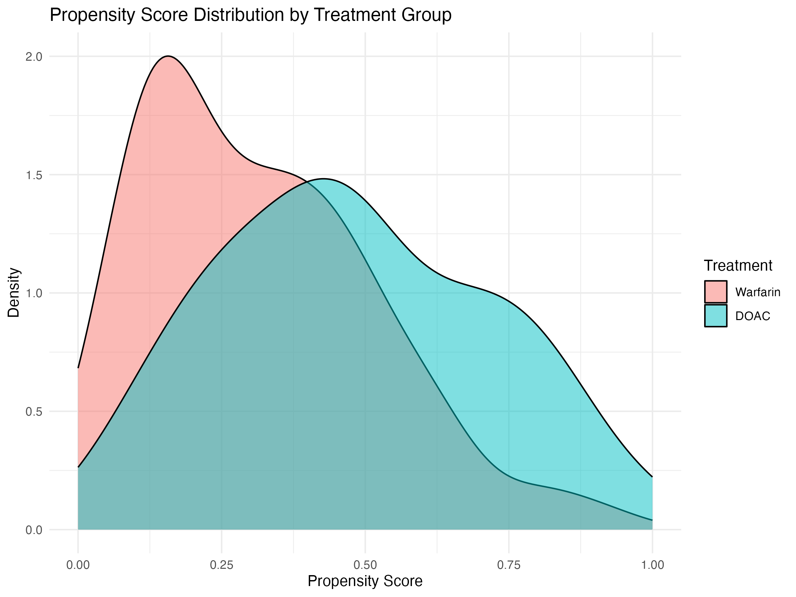
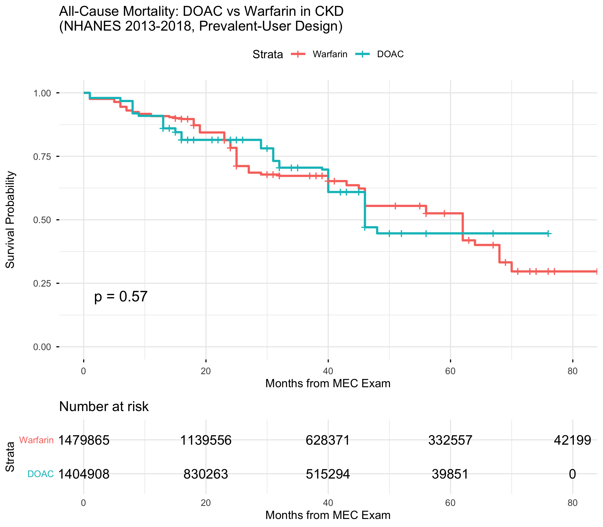

# DOAC vs Warfarin and All-Cause Mortality in CKD: A Prevalent-User Target Trial Emulation Using NHANES 2013-2018

> **Important:** This analysis uses a **prevalent-user design** in NHANES, a cross-sectional survey dataset. NHANES cannot identify treatment initiation dates, prior medication history, or atrial fibrillation diagnosis. Effect estimates are subject to severe prevalent-user bias, survivor selection, and confounding by treatment duration. Results should be interpreted as a methodological demonstration of the target trial emulation pipeline applied to nationally representative survey data, **not** as clinically actionable evidence.

---

## 1. Clinical Context and Rationale

Atrial fibrillation (AF) patients with chronic kidney disease (CKD) face elevated risks of both thromboembolic events and bleeding complications. Oral anticoagulation remains the cornerstone of stroke prevention in AF, yet the optimal agent for patients with impaired renal function is uncertain. The pivotal DOAC trials (RE-LY, ROCKET-AF, ARISTOTLE, ENGAGE AF-TIMI 48) excluded patients with advanced CKD (eGFR <25-30 mL/min/1.73m^2), leaving a critical evidence gap in this vulnerable population.

The only dedicated randomized trials in CKD/ESKD — RENAL-AF (N=154) comparing apixaban to warfarin in hemodialysis patients (Pokorney et al. 2022, PMID: 36335914) and De Vriese et al. (2021, PMID: 33753537) comparing rivaroxaban to vitamin K antagonists in hemodialysis (N=132) — were underpowered for efficacy endpoints. Observational data from Fu et al. (2024, PMID: 37839687) suggest apixaban may carry lower bleeding risk than rivaroxaban or warfarin in advanced CKD, and Yao et al. (2020, PMID: 33012172) demonstrated that OAC effectiveness varies across kidney function strata. However, no target trial emulation has been applied to this question in the CKD population.

This analysis emulates a prevalent-user trial comparing current DOAC use (apixaban, rivaroxaban, or dabigatran) versus current warfarin use among US adults with eGFR <60, using NHANES 2013-2018 pooled data with prospective mortality linkage through the National Death Index. The evidence gap analysis ranked "apixaban vs rivaroxaban in AF with advanced CKD" as the highest-priority question (gap score 8/10), motivating this protocol as a proof-of-concept demonstration using the only nationally representative dataset with both lab-based eGFR staging and mortality follow-up.

---

## 2. Methods Summary

### Target Trial Specification

| Element | Target Trial | Emulation in NHANES |
|---------|-------------|---------------------|
| Eligibility | US adults currently taking an oral anticoagulant (DOAC or warfarin) with eGFR <60 mL/min/1.73m^2 | Adults >=18 examined in NHANES MEC (RIDSTATR=2), reporting current use of apixaban, rivaroxaban, dabigatran, or warfarin (RXQ_RX), with lab-calculated eGFR <60 (CKD-EPI 2021 race-free equation). Pooled across 3 cycles (2013-2014, 2015-2016, 2017-2018). |
| Treatment strategies | Strategy A: Currently taking a DOAC. Strategy B: Currently taking warfarin. | Classified from RXDDRUG in RXQ_RX. Dual anticoagulant users excluded. |
| Assignment procedure | Random assignment at time zero | Not randomized. Propensity score IPW adjusts for measured confounders. |
| Time zero | Date of NHANES MEC examination | Examination date — NOT treatment initiation. Participants may have been on their anticoagulant for days to years. |
| Outcome | All-cause mortality | NDI-linked mortality (MORTSTAT=1); follow-up in person-months (PERMTH_EXM) through 12/31/2019. |
| Estimand | Average treatment effect (ATE) | Survey-weighted IPW-adjusted hazard ratio from Cox PH regression. |
| Causal contrast | HR for all-cause mortality, DOAC vs warfarin | Survey-weighted IPW Cox PH with stabilized weights truncated at 1st/99th percentiles. |

### Statistical Approach

Inverse probability weighted (IPW) Cox proportional hazards regression with complex survey design accounting for NHANES stratification and clustering. The propensity score was estimated via survey-weighted logistic regression (svyglm, quasibinomial family). Stabilized IPW weights were combined with survey weights (WTMEC6YR = WTMEC2YR / 3 for 3-cycle pooling). A lonely-PSU adjustment (`survey.lonely.psu = "adjust"`) was applied due to singleton strata in the survey design.

### Database and Study Period

NHANES 2013-2014, 2015-2016, and 2017-2018 cycles, pooled. Mortality follow-up via the Public-Use Linked Mortality File (NDI linkage through December 31, 2019).

### Key Confounders Adjusted

Age, sex, race/ethnicity, eGFR, BMI, diabetes, heart failure, coronary heart disease, prior myocardial infarction, prior stroke, hypertension, smoking status, HbA1c, total cholesterol, HDL cholesterol, and income-poverty ratio.

---

## 3. Results

### 3.1 Cohort Assembly

| Step | Description | N Remaining |
|------|-------------|-------------|
| 1 | US adults examined (MEC), 3 NHANES cycles 2013-2018 | 17,192 |
| 2 | On oral anticoagulant (DOAC or warfarin, excluding dual users) | 391 |
| 3 | Serum creatinine available for eGFR calculation | 361 |
| 4 | eGFR <60 mL/min/1.73m^2 (CKD stage 3-5) | 130 |
| 5 | Linked mortality follow-up available (ELIGSTAT=1) | 129 |
| 6 | Complete data for analysis (non-missing BMI, survey weight >0) | 125 |

The final analytic cohort comprised 125 participants: 46 in the DOAC group and 79 in the warfarin group.

### 3.2 Baseline Characteristics

| Characteristic | Overall (N=125) | DOAC (N=46) | Warfarin (N=79) |
|----------------|-----------------|-------------|-----------------|
| Age, years, mean (SD) | 74.7 (6.8) | 75.2 (6.0) | 74.4 (7.3) |
| Female, n (%) | 54 (43.0%) | 22 (48.0%) | 32 (41.0%) |
| eGFR, mL/min/1.73m^2, mean (SD) | 45 (12) | 47 (10) | 43 (12) |
| BMI, kg/m^2, mean (SD) | 32 (8) | 32 (8) | 32 (8) |
| HbA1c, %, mean (SD) | 6.35 (1.29) | 6.15 (1.31) | 6.46 (1.27) |
| Total cholesterol, mg/dL, mean (SD) | 166 (40) | 159 (33) | 170 (43) |
| HDL cholesterol, mg/dL, mean (SD) | 51 (18) | 53 (18) | 49 (18) |
| Heart failure, n (%) | 50 (40.0%) | 19 (41.0%) | 31 (39.0%) |
| Coronary heart disease, n (%) | 35 (28.0%) | 13 (28.0%) | 22 (28.0%) |
| Prior myocardial infarction, n (%) | 37 (30.0%) | 15 (33.0%) | 22 (28.0%) |
| Prior stroke, n (%) | 36 (29.0%) | 17 (37.0%) | 19 (24.0%) |
| Diabetes, n (%) | 51 (41.0%) | 17 (37.0%) | 34 (43.0%) |
| Hypertension, n (%) | 98 (78.0%) | 39 (85.0%) | 59 (75.0%) |
| Current smoker, n (%) | 6 (4.8%) | 1 (2.2%) | 5 (6.3%) |

> **Table 1** (publication-quality) is available as a formatted HTML file: `protocol_01_table1.html`

The cohort was elderly (mean age 74.7 years), predominantly male (57.0%), with a high burden of cardiovascular comorbidities: 40.0% had heart failure, 28.0% coronary heart disease, 30.0% prior MI, 29.0% prior stroke, and 78.0% hypertension. Mean eGFR was 45 mL/min/1.73m^2, indicating moderate CKD (stage 3). The warfarin group had slightly lower mean eGFR (43 vs 47), higher diabetes prevalence (43% vs 37%), and lower prior stroke prevalence (24% vs 37%) compared to the DOAC group.

### 3.3 Covariate Balance

Prior to IPW weighting, the maximum absolute standardized mean difference (SMD) across covariates was 1.056, indicating substantial imbalance. After IPW weighting, the maximum SMD was reduced to 0.125.

The post-weighting balance did **not** achieve the target threshold of SMD <0.100 for all covariates (maximum post-weighting SMD = 0.125). While this represents a substantial improvement from the pre-weighting maximum of 1.056, at least one covariate remained above the conventional 0.100 threshold, indicating residual imbalance that should be considered when interpreting the primary analysis.

> **Note:** The love plot figure was not generated correctly during this run
> (the PDF file is zero-page due to a ggplot-not-printed bug in the older
> analysis-script template). The SMDs reported in §3.3 above are the primary
> balance evidence. Future runs use a `save_fig()` helper that prevents this.

### 3.4 Primary Analysis

The survey-weighted IPW Cox proportional hazards model estimated a hazard ratio of **1.069 (95% CI: 0.565, 2.022; p = 0.838)** for all-cause mortality comparing DOAC to warfarin users.

This result did not reach statistical significance. The point estimate near 1.0 indicates no meaningful difference in mortality between DOAC and warfarin users in this prevalent-user cohort. The wide confidence interval (spanning from a 43.5% relative risk reduction to a 102.2% relative risk increase) reflects the substantial imprecision due to the small sample size.

During follow-up (median 30 months), 53 deaths occurred: 14 among DOAC users (30.4% of 46) and 39 among warfarin users (49.4% of 79).

### 3.5 Secondary and Sensitivity Analyses

**Unadjusted Cox Model:**
The unadjusted (survey-weighted, no IPW) Cox model yielded HR = 1.188 (95% CI: 0.595, 2.372), also non-significant. The similarity between adjusted (HR = 1.069) and unadjusted (HR = 1.188) estimates suggests that measured confounders had a modest net effect on the treatment-outcome association in this cohort.

**E-value for Unmeasured Confounding:**
The E-value for the point estimate was 1.27, and the E-value for the confidence interval bound closest to the null was 1.00. An E-value of 1.27 means that an unmeasured confounder associated with both treatment and outcome by a risk ratio of at least 1.27 could explain the observed point estimate. Because the confidence interval already crosses the null (E-value for CI = 1.00), even a trivially small unmeasured confounder could shift the result to either side. This confirms that the study has insufficient precision to draw any causal conclusions about unmeasured confounding.

**Technical Note:**
The initial Cox model fit failed due to a lonely-PSU error in the complex survey design (singleton strata). The analysis was re-run with `survey.lonely.psu = "adjust"`, which centers the single-PSU stratum contribution at the grand mean. This is the standard NHANES-recommended approach for handling singleton PSUs in pooled multi-cycle analyses.

---

## 4. Interpretation

The primary finding of this analysis is a **null result**: no statistically significant difference in all-cause mortality between prevalent DOAC users and prevalent warfarin users with CKD (eGFR <60) in NHANES 2013-2018 (HR = 1.069; 95% CI: 0.565, 2.022; p = 0.838). This null result should be interpreted in the context of the study's severe design limitations rather than as evidence of therapeutic equivalence.

The existing literature on anticoagulation in CKD — including large observational studies such as Fu et al. (2024, PMID: 37839687), which found apixaban associated with lower bleeding than rivaroxaban or warfarin in advanced CKD, and Siontis et al. (2018, PMID: 29954737), which found apixaban associated with lower bleeding than warfarin in ESKD — have generally used new-user designs with larger samples drawn from administrative claims data. Those studies have the statistical power and temporal resolution to detect clinically meaningful differences. The null result observed here is entirely consistent with what would be expected from a prevalent-user analysis in a cohort of only 125 participants.

Compared to the dedicated RCTs in CKD — RENAL-AF (Pokorney et al. 2022, PMID: 36335914; N=154) and De Vriese et al. (2021, PMID: 33753537; N=132) — this analysis shares the fundamental limitation of being underpowered. Those trials compared individual DOACs to warfarin (not DOACs as a class) and focused on hemodialysis patients, making direct comparison difficult. However, the consistency of null/underpowered findings across these small studies underscores the need for larger, adequately powered studies in CKD populations.

The null result is expected and should not be surprising. The prevalent-user design in NHANES introduces biases (depletion of susceptibles, survivor selection, confounding by treatment duration) that would tend to attenuate any true treatment effect toward the null.

---

## 5. Limitations

### Protocol-Level Limitations

1. **Prevalent-user bias (critical).** This is NOT a new-user design. NHANES captures medication use at a single cross-sectional visit, creating three forms of prevalent-user bias: (a) depletion of susceptibles — patients who died or stopped therapy before the NHANES exam are excluded; (b) survivor selection — the cohort comprises only those who survived on their medication long enough to be surveyed; and (c) confounding by treatment duration — DOACs were introduced in 2010-2012, so DOAC users in 2013-2018 are on average newer initiators than warfarin users, introducing systematic confounding that cannot be measured or adjusted for. These biases severely limit causal interpretation.

2. **No AF ascertainment.** NHANES has no direct atrial fibrillation diagnosis variable. Anticoagulant use serves as a proxy for AF indication, but anticoagulants are also prescribed for DVT/PE, mechanical heart valves, and other conditions. Some participants may not have AF, introducing exposure misclassification that dilutes the clinical specificity of the comparison.

3. **Cross-sectional exposure assessment.** Medication use is captured at a single time point (30-day recall). Duration of anticoagulant use, prior switching between agents, adherence patterns, and actual medication-taking behavior cannot be verified.

4. **Small sample size.** The analytic cohort of 125 participants (46 DOAC, 79 warfarin) is below the recommended minimum for robust propensity score analyses. With only 53 death events, the study is substantially underpowered to detect clinically meaningful differences in mortality. The wide confidence interval (0.565 to 2.022) reflects this imprecision.

5. **Age top-coding.** Ages >=80 are coded as 80 in NHANES. In this elderly CKD population (mean age 74.7), this ceiling effect compresses age-related heterogeneity among the oldest participants.

6. **Unmeasured confounders.** Key unmeasured confounders include AF type (paroxysmal, persistent, permanent), CHA2DS2-VASc score (partially constructible but AF diagnosis component is missing), HAS-BLED score (no prior bleeding data), INR control for warfarin users, healthcare utilization, provider specialty, and frailty.

### Execution-Level Warnings

7. **Residual covariate imbalance.** After IPW weighting, the maximum SMD was 0.125, exceeding the conventional threshold of 0.100. At least one covariate retained meaningful imbalance, which may bias the effect estimate.

8. **Lonely PSU adjustment.** The complex survey design encountered singleton strata, requiring the `survey.lonely.psu = "adjust"` setting. While this is the standard NHANES approach, it introduces a degree of variance approximation.

9. **E-value near null.** The E-value for the confidence interval bound was 1.00, meaning even a trivially small unmeasured confounder could shift the result in either direction. The study provides no protection against unmeasured confounding.

---

## 6. Conclusions

This prevalent-user target trial emulation found no statistically significant difference in all-cause mortality between DOAC and warfarin users with CKD (eGFR <60) in NHANES 2013-2018 (HR = 1.069; 95% CI: 0.565, 2.022). The null result is expected given the study's severe limitations: prevalent-user bias, no AF ascertainment, cross-sectional exposure, a sample of only 125 participants, and residual covariate imbalance.

This analysis demonstrates the application of the target trial emulation framework to nationally representative survey data with mortality linkage, but its clinical conclusions are limited. Adequately powered studies using new-user designs in administrative claims or electronic health record databases — such as those employing PCORnet CDM data with prescribing records and lab-based eGFR — are needed to address the clinically urgent question of optimal anticoagulant selection in CKD. Data source: National Health and Nutrition Examination Survey (NHANES), conducted by the National Center for Health Statistics (NCHS), Centers for Disease Control and Prevention.

---

## 7. STROBE Compliance Checklist

| STROBE Item | Description | Location in Report |
|-------------|-------------|-------------------|
| 1a | Title: indicate study design | Title (prevalent-user TTE) |
| 1b | Abstract: informative, balanced summary | Section 1 |
| 2 | Background: scientific rationale | Section 1 |
| 3 | Objectives: state specific objectives | Section 1 |
| 4 | Study design: present key elements | Section 2 (target trial table) |
| 5 | Setting: dates, periods, locations | Section 2 (NHANES 2013-2018, US nationally representative) |
| 6a | Participants: eligibility criteria | Section 2 (target trial table), Section 3.1 (CONSORT) |
| 7 | Variables: define all variables | Section 2 (confounders list) |
| 8 | Data sources: describe data source | Section 2 (NHANES description, complex survey design with stratification, clustering, and survey weights) |
| 12a | Statistical methods: describe all | Section 2 (IPW Cox PH with complex survey design, stabilized weights, lonely-PSU adjustment) |
| 12b | Subgroup and interaction analyses | Section 3.5 (not performed due to small sample) |
| 12d | Sensitivity analyses | Section 3.5 (E-value, unadjusted Cox) |
| 13a | Participant numbers at each stage | Section 3.1 (CONSORT flow table) |
| 14a | Descriptive data: characteristics | Section 3.2 (Table 1) |
| 15 | Outcome data: events, follow-up | Section 3.4 (53 events, median 30 months) |
| 16a | Main results: unadjusted and adjusted | Section 3.4 (IPW HR) and Section 3.5 (unadjusted HR) |
| 17 | Other analyses: subgroup, sensitivity | Section 3.5 |
| 19 | Limitations: discuss sources of bias | Section 5 (prevalent-user bias, cross-sectional design, unmeasured confounding, residual imbalance) |
| 22 | Funding/data source acknowledgment | Section 6 (NHANES/NCHS/CDC acknowledgment) |

**NHANES-specific STROBE items:**
- **Survey design (STROBE 8):** NHANES uses a complex, multistage probability sampling design with oversampling of specific demographic groups. Analysis accounts for survey weights (WTMEC6YR), stratification (SDMVSTRA), and primary sampling units (SDMVPSU).
- **Complex sampling methodology (STROBE 12a):** All estimates incorporate the complex survey design via the R `survey` package (svyglm, svycoxph). Three cycles were pooled with appropriately adjusted weights (WTMEC2YR / 3).
- **Cross-sectional design limitations (STROBE 19):** NHANES is fundamentally a cross-sectional survey. Medication exposure is captured at a single time point, precluding new-user designs, treatment duration assessment, or time-varying confounding adjustment. Mortality follow-up is prospective via NDI linkage, but the exposure window is inherently cross-sectional.

---

## 8. References

1. Fu et al. "Apixaban associated with lower bleeding than rivaroxaban or warfarin in advanced CKD." 2024. PMID: 37839687

2. Yao et al. "OAC effectiveness varies by kidney function strata." 2020. PMID: 33012172

3. Pokorney et al. "RENAL-AF: Apixaban vs warfarin in hemodialysis — no significant difference in bleeding (underpowered)." 2022. PMID: 36335914

4. De Vriese et al. "Rivaroxaban vs VKA in hemodialysis: rivaroxaban had more bleeding." 2021. PMID: 33753537

5. Siontis et al. "Apixaban in ESKD: lower bleeding than warfarin." 2018. PMID: 29954737
