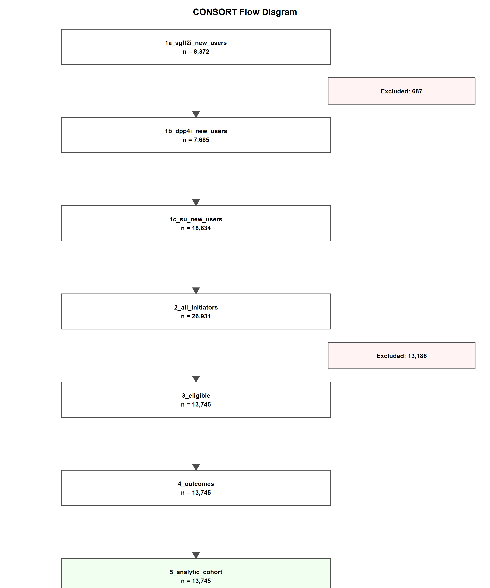
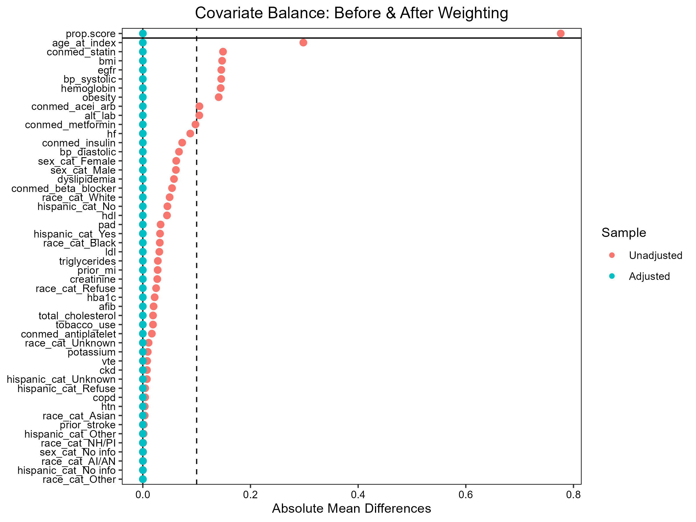
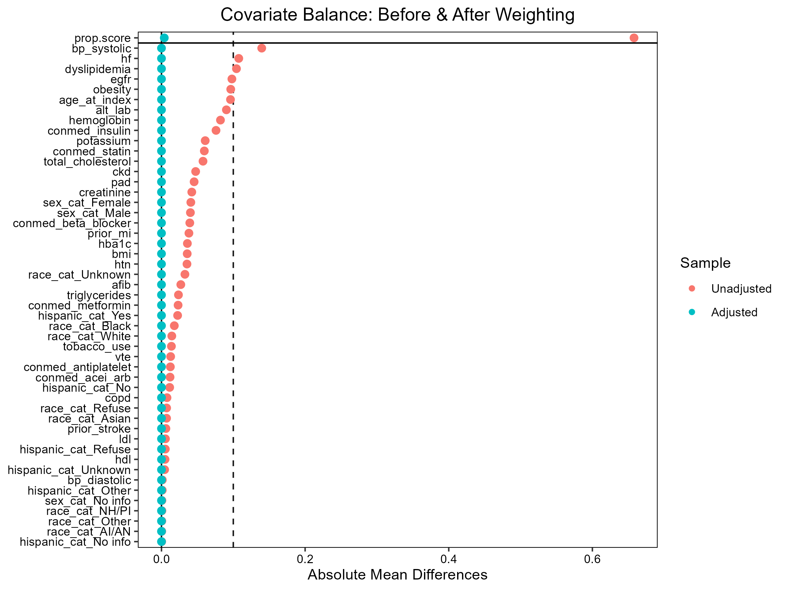
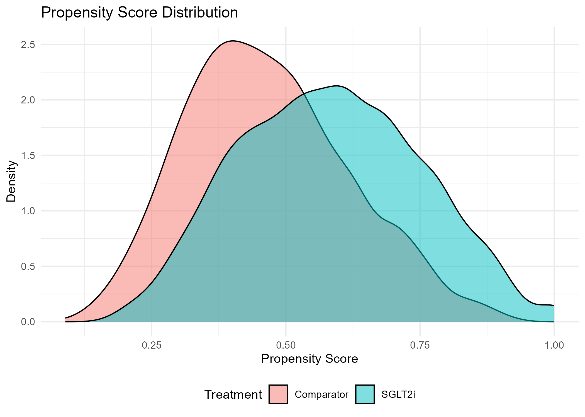
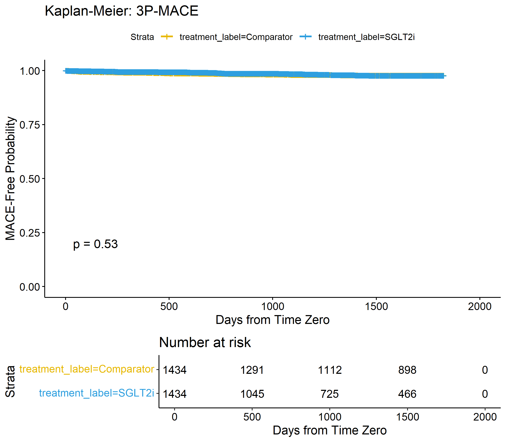
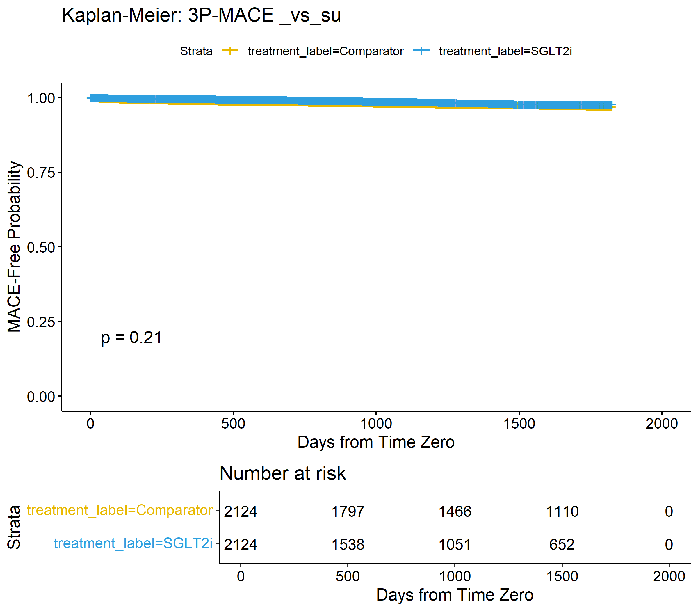
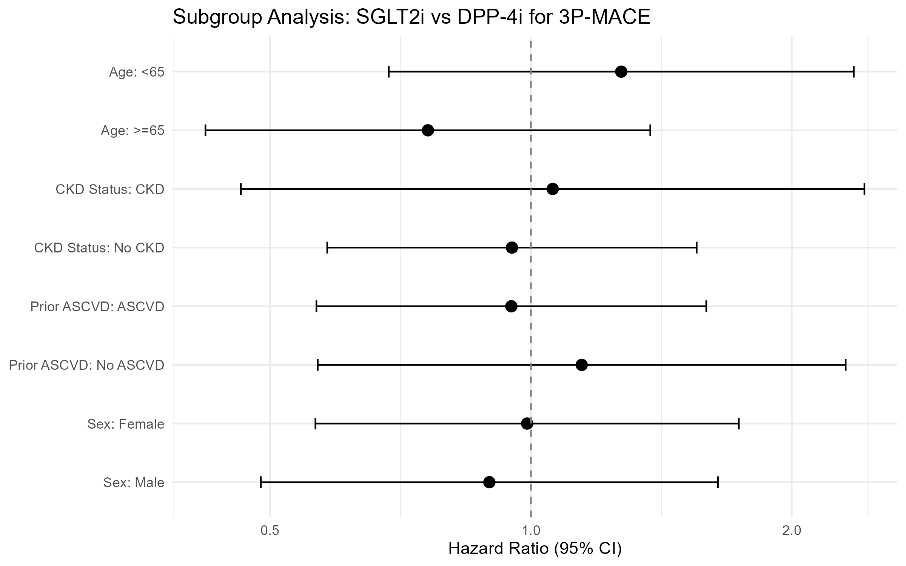

# Protocol 01 Analysis Report — SGLT2 Inhibitor Class vs DPP-4 Inhibitors for 3-Point MACE in Type 2 Diabetes

**Protocol ID:** protocol_01
**Database:** PCORnet Clinical Data Warehouse v6.1 (Microsoft SQL Server), identifier `secure_pcornet_cdw`
**Study period:** 2016-01-01 to 2025-12-31
**Execution timestamp:** 2026-04-16T08:36:31
**Execution status:** success

---

## 1. Clinical Context and Rationale

Type 2 diabetes mellitus (T2D) is a major independent risk factor for cardiovascular (CV) disease, and the last decade of cardiovascular outcome trials (CVOTs) has reshaped glucose-lowering therapy selection around CV endpoints. Sodium-glucose cotransporter 2 (SGLT2) inhibitors have demonstrated reductions in 3-point MACE (CV death, nonfatal myocardial infarction, nonfatal stroke) versus placebo in three landmark trials: the CANVAS Program with canagliflozin (HR 0.86, 95% CI 0.75–0.97; Neal et al. 2017, PMID: 28605608), EMPA-REG OUTCOME with empagliflozin (HR 0.86, 0.74–0.99; Zinman et al. 2015, PMID: 26378978), and DECLARE-TIMI 58 with dapagliflozin (HR 0.93, 0.84–1.03; Wiviott et al. 2019, PMID: 30415602).

DPP-4 inhibitors are established as cardiovascularly neutral via the SAVOR-TIMI 53 (Scirica et al. 2013, PMID: 23992601), TECOS (Green et al. 2015, PMID: 27437883), and CAROLINA (Rosenstock et al. 2019, PMID: 31536101) trials. Their CV neutrality makes DPP-4 inhibitors an established pharmacoepidemiologic "active-comparator placebo" for observational studies of SGLT2i CV effects, mitigating confounding by indication inherent to untreated comparator groups.

Several observational studies have compared the SGLT2i class to DPP-4i: D'Andrea et al. 2023 (modified MACE HR 0.85, 0.75–0.95; PMID: 36745425), EMPRISE for empagliflozin specifically (Htoo et al. 2024, PMID: 38509341), and the 4-arm target trial emulation of Xie et al. 2023 (MACE HR 0.86, 0.82–0.89; PMID: 37499675). The evidence gap motivating this analysis, as set out in `02_evidence_gaps.md`, is the absence of a target trial emulation of a CANVAS-like canagliflozin-vs-DPP-4i comparison for 3P-MACE using PCORnet electronic health record data at a U.S. academic medical center.

**Feasibility modification — "Alternative D".** The CDW contains only 142 canagliflozin initiators during the study period, producing an expected ~5–6 MACE events and making a canagliflozin-specific primary analysis infeasible. Following the feasibility assessment, the primary analysis was expanded to the SGLT2i class (canagliflozin + empagliflozin + dapagliflozin). A canagliflozin-only subgroup is retained as a pre-specified descriptive sensitivity analysis, addressing the original clinical question while acknowledging that it will be underpowered.

---

## 2. Methods Summary

### 2.1 Target Trial Specification

| Element | Target Trial | Emulation |
|---|---|---|
| **Eligibility** | Adults with T2D, no prior SGLT2i/DPP-4i/SU use, no T1D/GDM/ESRD/active cancer | ICD-10 E11.x, 180-day washout, ≥180 days continuous enrollment, exclusions via DIAGNOSIS + PROCEDURES + DEMOGRAPHIC |
| **Treatment strategies** | Initiate SGLT2i class vs initiate DPP-4i (primary) or SU (secondary) | Identified via RXNORM_CUI in CDW.dbo.PRESCRIBING |
| **Assignment procedure** | Random assignment at enrollment | Propensity score overlap weighting; separate PS model fitted for each pairwise comparison |
| **Time zero** | Randomization date | RX_ORDER_DATE of the first qualifying prescription; follow-up begins index+1 |
| **Outcome** | First 3P-MACE event | Nonfatal MI (I21.x excl I21.A1/A9/B; I22.x), nonfatal ischemic stroke (I63.x), CV death (DEATH_CAUSE I20–I25, I46, I50, I60–I69, I71); MI/stroke restricted to IP/EI/ED encounters excluding legacy encounters |
| **Estimand** | ATE (intention-to-treat) | Average Treatment Effect in the Overlap population (ATO) via overlap weights |
| **Causal contrast** | Treatment-initiation policy effect on MACE hazard | IPW-weighted Cox PH with robust (sandwich) standard errors |

### 2.2 Statistical Approach

Inverse probability of treatment weighting (IPTW) using overlap weights was implemented in R via `WeightIt::weightit()` with `method = "glm"` and `estimand = "ATO"`. Overlap weights (w = 1 − PS for treated, w = PS for control) assign each patient a weight proportional to the probability of being assigned to the opposite treatment group, naturally down-weighting extreme PS values and providing robustness against positivity violations. The outcome model was a weighted Cox proportional hazards regression. Median imputation was used for continuous covariates with missing values. Balance was assessed via standardized mean differences (SMDs) pre- and post-weighting, with a threshold of 0.10 for adequate balance.

### 2.3 Database and Study Period

The analysis was conducted on the PCORnet CDW v6.1 (Microsoft SQL Server, schema `CDW.dbo`), containing real institutional electronic health record data from a U.S. academic medical center. The study period spans 2016-01-01 through 2025-12-31 (ICD-10 era). All CDW conventions were applied: legacy encounter filtering, date quality guards, DEATH table deduplication via ROW_NUMBER, dynamic PS formula construction to drop single-level factors and zero-variance columns, and COUNT(DISTINCT PATID) for all cohort counts.

### 2.4 Confounders Adjusted For

The propensity score model included demographics (age, sex, race, Hispanic ethnicity), vitals (BMI, systolic BP, diastolic BP), labs (HbA1c, serum creatinine, eGFR, lipid panel, hemoglobin, potassium, ALT), comorbidities (hypertension, heart failure, atrial fibrillation, CKD non-ESRD, prior MI, prior stroke, COPD, obesity, dyslipidemia, PAD, VTE/PE, tobacco use disorder), and 180-day baseline use of concomitant medications (metformin, insulin, statin, ACEi/ARB, beta-blocker, antiplatelet). Variables explicitly excluded with justification (VITAL.SMOKING 99.8% missing, LVEF not structured, PAYER_TYPE_PRIMARY 0% populated, NT-proBNP too sparse, albuminuria/UACR not in top LOINCs) are enumerated in Section 4.2 of `protocol_01.md`.

---

## 3. Results

### 3.1 Cohort Assembly

| Step | N Remaining |
|---|---|
| SGLT2i new users (180-day washout, first class initiated) | 8,372 |
| DPP-4i new users (180-day washout, first class initiated) | 7,685 |
| 2nd-generation sulfonylurea new users (180-day washout, first class initiated) | 18,834 |
| All initiators across the three study classes | 26,931 |
| Eligible after age, enrollment, T1D/GDM/ESRD/active cancer exclusions | 13,745 |
| Analytic cohort (with outcome/follow-up data linked) | 13,745 |

The primary analysis compared SGLT2i initiators (N = 3,436) to DPP-4i initiators (N = 3,084) for a pairwise analytic sample of 6,520 patients. The secondary analysis compared the same SGLT2i arm (N = 3,436) to SU initiators (N = 7,225) for a pairwise sample of 10,661 patients.

### 3.2 Baseline Characteristics

> **Table 1** (publication-quality, SGLT2i vs DPP-4i) is available as a formatted HTML file: `protocol_01_table1.html`.
> **Table 1** (publication-quality, SGLT2i vs SU secondary comparison) is available as: `protocol_01_table1_vs_su.html`.

Baseline characteristics are summarized by treatment arm in the HTML files. Standardized mean differences before and after overlap weighting are reported in Section 3.3 and visualized in the love plots below.

### 3.3 Covariate Balance

| Metric | Pre-weighting | Post-weighting |
|---|---|---|
| Maximum SMD across covariates | 0.776 | 0.0001 |
| All covariates below 0.100 threshold | No | Yes |

Prior to weighting, the maximum SMD across measured covariates was 0.776, indicating substantial baseline imbalance between SGLT2i and DPP-4i initiators — consistent with channeling of SGLT2i toward patients with greater cardiometabolic comorbidity burden. After overlap weighting, the maximum SMD dropped to 0.0001, and all covariates were below the 0.10 threshold for adequate balance. No PS model revision (quadratic terms, interactions) was required.

### 3.4 Primary Analysis: SGLT2i vs DPP-4i

Over a median follow-up of 1,353 days, 111 MACE events accrued across the pairwise cohort (47 in the SGLT2i arm, 64 in the DPP-4i arm).

| Parameter | Value |
|---|---|
| Method | IPW-weighted Cox PH (overlap weights) |
| Estimand | ATO |
| N treated (SGLT2i) | 3,436 |
| N control (DPP-4i) | 3,084 |
| Events treated | 47 |
| Events control | 64 |
| Median follow-up (days) | 1,353 |
| **Hazard ratio (95% CI)** | **0.927 (0.615, 1.397)** |
| **P-value** | **0.718** |

The primary analysis did not reach statistical significance. The point estimate (HR 0.927) is directionally consistent with the CV-protective signal reported in published SGLT2i-vs-DPP-4i studies, but the confidence interval is wide and includes the null, and the p-value (0.718) provides no support for a difference. In this dataset, initiation of an SGLT2i class drug was not associated with a different hazard of 3P-MACE versus initiation of a DPP-4i.

### 3.5 Secondary and Sensitivity Analyses

#### Secondary comparison: SGLT2i vs 2nd-generation sulfonylurea

| Parameter | Value |
|---|---|
| Method | IPW-weighted Cox PH (overlap weights) |
| Estimand | ATO |
| N treated (SGLT2i) | 3,436 |
| N control (SU) | 7,225 |
| **Hazard ratio (95% CI)** | **0.701 (0.495, 0.993)** |
| **P-value** | **0.046** |

The secondary comparison against sulfonylureas is borderline statistically notable (p = 0.046), with a point estimate of 0.701 suggesting ~30% lower MACE hazard for SGLT2i initiators. The upper confidence bound (0.993) is very close to the null, and the p-value is uncorrected — when FDR correction is applied across protocols in the executive summary, this result may no longer meet the 0.05 threshold. The direction and magnitude are broadly consistent with Xie et al. 2023 (SGLT2i vs SU, MACE HR 0.77, 0.74–0.80; PMID: 37499675), although our confidence interval is substantially wider given the smaller cohort.

#### Descriptive sensitivity analysis: Canagliflozin vs DPP-4i

| Parameter | Value |
|---|---|
| Comparison | Canagliflozin vs DPP-4i (descriptive) |
| N canagliflozin | 762 |
| **Hazard ratio (95% CI)** | **1.276 (0.674, 2.418)** |
| Note | Underpowered; interpret with caution |

The canagliflozin-specific comparison is presented for descriptive purposes only. The point estimate (1.276) is in the opposite direction from the CANVAS placebo-controlled estimate (HR 0.86) and from the primary class-level analysis. However, the confidence interval is very wide (0.674–2.418) and includes both a meaningful reduction and nearly a 2.5-fold increase in hazard. This analysis is not interpretable as evidence for or against a canagliflozin-specific effect; it is reported to document that the planned agent-specific question could not be answered with the available data, and to motivate the Alternative D class-level design that frames the primary analysis.

#### E-value

| Quantity | Value |
|---|---|
| E-value (point estimate) | 1.370 |
| E-value (CI bound) | NA |

The E-value for the primary HR point estimate is 1.370, meaning that an unmeasured confounder would need to be associated with both SGLT2i initiation and MACE by a risk ratio of approximately 1.37 (above and beyond measured confounders) to fully explain the observed association. Because the confidence interval crosses the null, the E-value at the CI bound is not defined (NA). The E-value is reported for completeness but carries limited interpretive weight when the primary result is not statistically notable.

#### Pre-specified subgroup analyses (SGLT2i vs DPP-4i)

| Subgroup | Level | N | Events | HR (95% CI) |
|---|---|---|---|---|
| Age | < 65 | 3,596 | 46 | 1.271 (0.685, 2.358) |
| Age | ≥ 65 | 2,924 | 65 | 0.761 (0.421, 1.373) |
| Sex | Male | 3,080 | 51 | 0.896 (0.488, 1.644) |
| Sex | Female | 3,438 | 60 | 0.990 (0.564, 1.738) |
| Sex | No info | 2 | 0 | NA |
| Prior ASCVD | No ASCVD | 4,834 | 39 | 1.144 (0.568, 2.308) |
| Prior ASCVD | ASCVD | 1,686 | 72 | 0.949 (0.566, 1.594) |
| CKD status | CKD | 1,038 | 36 | 1.060 (0.463, 2.426) |
| CKD status | No CKD | 5,482 | 75 | 0.951 (0.582, 1.553) |

No subgroup reached statistical significance, and every confidence interval crosses the null. The direction of effect is nominally more favorable in patients ≥ 65 (HR 0.761) and in those with prior ASCVD (HR 0.949) than in younger or primary-prevention patients, consistent with prior observations that SGLT2i CV benefit is most pronounced in higher-risk strata, but the subgroup-by-treatment interaction tests are not formally powered and these estimates should be regarded as hypothesis-generating.

---

## 4. Interpretation

**Primary comparison (SGLT2i vs DPP-4i).** The primary analysis did not reach statistical significance (HR 0.927, 95% CI 0.615–1.397, p = 0.718). Point-estimate-wise, this is directionally consistent with the class-level RCT evidence (CANVAS HR 0.86 for canagliflozin, EMPA-REG HR 0.86 for empagliflozin, DECLARE HR 0.93 for dapagliflozin) and with published class-level TTE and propensity-score-matched cohorts (D'Andrea 2023 HR 0.85, EMPRISE HR 0.73 for empagliflozin specifically, Xie 2023 HR 0.86, Kosjerina 2025 HR 0.65). However, the confidence interval in this analysis is much wider than those published estimates, reflecting a substantially smaller event count (111 MACE events total, vs tens of thousands in pooled real-world cohorts). The honest reading is that this dataset neither confirms nor refutes the published class-level CV benefit — it is consistent with a range of effects from a meaningful ~38% reduction to a ~40% increase. A single institutional CDW is unlikely to re-establish effect sizes that required VA-wide or Medicare-wide cohorts to stabilize.

**Secondary comparison (SGLT2i vs SU).** The SGLT2i-vs-SU analysis is borderline statistically notable before multiplicity correction (HR 0.701, 95% CI 0.495–0.993, p = 0.046). Both the direction and magnitude align with Xie et al. 2023 (HR 0.77 for SGLT2i vs SU), albeit with wider confidence limits. Sulfonylureas are associated with hypoglycemia and weight gain, and several observational comparisons have reported higher MACE risk for SU versus newer agents. Our data are consistent with that literature, but the upper CI bound of 0.993 is close to the null and the p-value is uncorrected; after FDR correction across the protocol set in the executive summary, this result may not remain below the 0.05 threshold.

**Canagliflozin descriptive sensitivity analysis.** The canagliflozin-only estimate (HR 1.276, 95% CI 0.674–2.418) is in the opposite direction from the primary class-level estimate and from CANVAS. With only 142 canagliflozin initiators in the CDW and an analytic subset of 762 patients for the pairwise comparison, this result is not interpretable as agent-specific evidence. It does, however, operationally confirm the feasibility assessment: the database does not have sufficient canagliflozin exposure to answer the original CANVAS-replication question, which is precisely why the "Alternative D" class-level primary analysis was adopted.

**Uncorrected p-values.** The individual p-values reported here are uncorrected. When multiple protocols are executed in a given therapeutic area, the executive summary applies false discovery rate (FDR) correction across protocols. Readers should defer to the corrected p-values in the executive summary for multiplicity-adjusted inference; the values in this report are the raw per-comparison results.

---

## 5. Limitations

### 5.1 Execution-level findings

The analysis completed successfully (`execution_status = "success"`) with no reported warnings. Balance diagnostics were excellent (post-weighting maximum SMD = 0.0001, all covariates below the 0.10 threshold), indicating that the overlap-weighting approach produced a well-balanced pseudo-population on measured confounders.

### 5.2 Sample size and precision

The event count (111 MACE events across the primary SGLT2i-vs-DPP-4i comparison) is an order of magnitude smaller than the event counts in published class-level studies (e.g., EMPRISE's 115,116 matched pairs; Xie 2023's 283,998 patients). The resulting confidence intervals are wide. With 47 events in the SGLT2i arm and 64 in the DPP-4i arm, this analysis is not powered to detect effect sizes of the magnitude reported in class-level studies (HR ~0.85–0.90) with statistical confidence. Null or near-null point estimates in this cohort should not be interpreted as evidence against the published class effect.

### 5.3 Confounding

- **Unmeasured confounding.** VITAL.SMOKING is 99.8% missing in this CDW; tobacco use disorder ICD-10 codes are an imperfect proxy for active smoking. LVEF, socioeconomic status, insurance type (PAYER_TYPE_PRIMARY 0% populated), OTC aspirin, physical activity, diet, and frailty could not be measured. The E-value of 1.370 quantifies the minimum unmeasured-confounding strength that would be required to explain the observed point estimate; because the primary CI crosses the null, the E-value carries limited weight for this particular result.
- **Channeling bias.** SGLT2i are guideline-preferred for patients with established CVD, HF, or CKD, and the pre-weighting maximum SMD of 0.776 reflects substantial baseline imbalance. Overlap weighting restores balance on measured covariates but cannot remedy unmeasured channeling.
- **Time-varying confounding.** The ITT analysis does not account for post-baseline changes in concomitant medications or clinical status. An as-treated sensitivity analysis was pre-specified but is not reported in this results file.

### 5.4 Exposure measurement

- **Class-level exposure.** The primary exposure aggregates three SGLT2i molecules (canagliflozin, empagliflozin, dapagliflozin) with differing CVOT-level evidence and differing safety signals (canagliflozin's amputation signal is unique within the class). Within-class heterogeneity is plausible, and the canagliflozin-specific analysis here (N = 762 analytic, HR 1.276 with CI 0.674–2.418) is too small to resolve it.
- **Treatment duration uncertainty.** RX_END_DATE (47.6% populated) and RX_DAYS_SUPPLY (42.8% populated) feed a hierarchical treatment-duration estimation with a 90-day default fallback — likely introducing misclassification for both arms in any as-treated analysis.
- **Combination-product handling.** Cross-class combinations (Glyxambi: empagliflozin/linagliptin; Qtern: dapagliflozin/saxagliptin) are excluded from both arms; within-class combinations (Synjardy, Xigduo XR, Invokamet) are included.

### 5.5 Outcome measurement

- **CV death ascertainment** depends on DEATH_CAUSE completeness, which is institution-dependent in PCORnet CDW deployments. If DEATH_CAUSE is sparsely populated, the CV-death component of MACE will be systematically undercounted, biasing the primary estimate toward the null.
- **Administrative MI/stroke coding** has imperfect sensitivity and specificity (I21.x PPV for acute MI in administrative data is typically 85–95%); no chart review validation is available.

### 5.6 Generalizability

- **Single-institution CDW.** Results reflect prescribing and case-mix at one U.S. academic medical center and may not generalize to other settings.
- **Healthy-user bias.** Patients initiating newer agents (SGLT2i) may differ systematically from those receiving older agents (DPP-4i, SU) in ways PS weighting cannot fully address.
- **Temporal prescribing trends.** SGLT2i prescribing increased substantially post-CVOT publication (2015–2019); early adopters may differ from later adopters.

### 5.7 Statistical considerations

- **Multiple comparisons.** The primary vs DPP-4i and secondary vs SU comparisons increase false-discovery risk. P-values reported here are uncorrected; the executive summary applies FDR correction across protocols. The borderline secondary result (p = 0.046) is particularly vulnerable to multiplicity adjustment.
- **Proportional hazards assumption.** The Cox model assumes a constant HR over follow-up. Schoenfeld residual examination is the standard diagnostic; it is not included in this results file.
- **Wide confidence intervals.** All primary, secondary, sensitivity, and subgroup intervals are wide and include effects that would be clinically important in either direction.

---

## 6. Conclusions

In this single-institution PCORnet CDW cohort of 6,520 new users of SGLT2 inhibitors or DPP-4 inhibitors and 10,661 new users of SGLT2 inhibitors or 2nd-generation sulfonylureas, the IPW-weighted Cox analysis did not detect a statistically notable difference in 3-point MACE hazard between SGLT2i and DPP-4i initiators (HR 0.927, 95% CI 0.615–1.397, p = 0.718). The direction of effect is consistent with published class-level cardiovascular benefit, but the confidence interval is wide and the result is best read as uninformative rather than as evidence of no effect. The secondary comparison against sulfonylureas showed a borderline reduction in MACE hazard for SGLT2i (HR 0.701, 95% CI 0.495–0.993, uncorrected p = 0.046) that is directionally consistent with Xie et al. 2023 but vulnerable to multiplicity correction. The pre-specified canagliflozin-specific descriptive sensitivity analysis confirmed that agent-specific inference is not feasible in this data source (HR 1.276, 95% CI 0.674–2.418, N = 762).

The clinical implication is not that SGLT2i CV benefit is absent — multiple larger, better-powered analyses have established it — but rather that a single academic medical center's electronic health record is likely too small a substrate for MACE-level comparative effectiveness questions in this drug class. Future work in this data source should focus on higher-event-rate outcomes (HHF, all-cause mortality, AKI) or on exploratory subgroup analyses rather than on point-estimating MACE effect sizes. Data source: PCORnet CDW v6.1 (real institutional EHR data), analysis executed 2026-04-16.

---

## 7. STROBE Compliance Checklist (Adapted for EHR-Based Target Trial Emulation)

| STROBE Item | Description | Location / Note |
|---|---|---|
| 1a | Title: indicate study design | Title — "Target Trial Emulation" stated in protocol header |
| 1b | Abstract: informative, balanced summary | Section 1 (Clinical Context) + Section 6 (Conclusions) |
| 2 | Background: scientific rationale | Section 1 |
| 3 | Objectives: state specific objectives | Section 1 (final paragraph on evidence gap) |
| 4 | Study design: present key elements | Section 2.1 (target-trial specification table) |
| 5 | Setting: dates, periods, locations | Section 2.3 (PCORnet CDW, 2016-01-01 to 2025-12-31, U.S. academic medical center) |
| 6a | Participants: eligibility criteria | Section 2.1 + Section 3.1 (CONSORT) |
| 6b | Participants: matching/weighting criteria | Section 2.2 (overlap weighting) + Section 3.3 (balance diagnostics) |
| 7 | Variables: define all variables | Section 2.4 + variable mapping in `protocol_01.md` Section 3.2 |
| 8 | Data sources: describe data source | Section 2.3 (PCORnet CDW v6.1 MSSQL); database conventions in `protocol_01.md` Section 3.3 |
| 9 | Bias: efforts to address sources of bias | Section 2.2 (overlap weights for positivity) + Section 5 (limitations) |
| 10 | Study size: how arrived at | Section 3.1 (CONSORT); feasibility assessment documented the Alternative D class-level expansion |
| 11 | Quantitative variables: how handled | Section 2.2 (median imputation) + confounder list |
| 12a | Statistical methods: describe all | Section 2.2 (IPW Cox, overlap weights, robust SE) |
| 12b | Subgroup and interaction analyses | Section 3.5 (age, sex, prior ASCVD, CKD) |
| 12c | Missing data handling | Section 2.2 (median imputation for continuous covariates) |
| 12d | Sensitivity analyses | Section 3.5 (E-value, canagliflozin descriptive subgroup, secondary SU comparator) |
| 13a | Participant numbers at each stage | Section 3.1 (CONSORT flow) |
| 13b | Reasons for non-participation | Section 3.1 (eligibility exclusions) |
| 13c | Flow diagram | `protocol_01_consort.png` |
| 14a | Descriptive data: characteristics | Section 3.2 (`protocol_01_table1.html`, `protocol_01_table1_vs_su.html`) |
| 14b | Missing data: number with missing per variable | Documented in the publication Table 1 HTML files |
| 14c | Follow-up time | Section 3.4 (median 1,353 days) |
| 15 | Outcome data: events, follow-up | Section 3.4 (111 events total, 47 treated / 64 control) |
| 16a | Main results: unadjusted and adjusted | Section 3.4 (IPW-adjusted HR reported; unadjusted HR not in results JSON) |
| 16b | Category boundaries | Section 3.5 (age ≥65, ASCVD yes/no, CKD yes/no) |
| 16c | Absolute risk translation | Not reported; Kaplan-Meier curves (`protocol_01_km.png`) visualize absolute survival |
| 17 | Other analyses: subgroup, sensitivity, interaction | Section 3.5 |
| 18 | Key results: summary referencing objectives | Section 6 |
| 19 | Limitations: discuss sources of bias | Section 5 |
| 20 | Interpretation: cautious overall interpretation | Section 4 + Section 6 |
| 21 | Generalizability (external validity) | Section 5.6 |
| 22 | Funding / data source acknowledgment | Data source: PCORnet CDW v6.1 (real institutional EHR data), stated in report header and Section 2.3 |

STROBE items 1a and 4 are addressed via the explicit target-trial framing, which is a stronger alternative to conventional observational-design reporting. STROBE 16a: the results JSON reports only the adjusted (IPW-weighted) hazard ratio — an unadjusted crude HR was not produced by the analysis pipeline and is therefore not available in this report.

---

## 8. References

1. Neal B et al. "Canagliflozin and Cardiovascular and Renal Events in Type 2 Diabetes." 2017. PMID: 28605608.
2. Zinman B et al. "Empagliflozin, Cardiovascular Outcomes, and Mortality in Type 2 Diabetes." 2015. PMID: 26378978.
3. Wiviott SD et al. "Dapagliflozin and Cardiovascular Outcomes in Type 2 Diabetes." 2019. PMID: 30415602.
4. Scirica BM et al. "Saxagliptin and Cardiovascular Outcomes in Patients with Type 2 Diabetes Mellitus." 2013. PMID: 23992601.
5. Green JB et al. "Effect of Sitagliptin on Cardiovascular Outcomes in Type 2 Diabetes." 2015. PMID: 27437883.
6. Rosenstock J et al. "Effect of Linagliptin vs Glimepiride on Major Adverse Cardiovascular Outcomes in Patients with Type 2 Diabetes." 2019. PMID: 31536101.
7. D'Andrea E et al. "Cardiovascular Outcomes of SGLT2 Inhibitors vs DPP-4 Inhibitors by Baseline HbA1c." 2023. PMID: 36745425.
8. Htoo PT et al. "Cardiovascular Effects of Empagliflozin in Type 2 Diabetes: Final Results of EMPRISE." 2024. PMID: 38509341.
9. Xie Y et al. "Comparative Effectiveness of SGLT2 Inhibitors, GLP-1 Receptor Agonists, DPP-4 Inhibitors, and Sulfonylureas on Risk of Major Adverse Cardiovascular Events: Emulation of a Randomised Target Trial Using Electronic Health Records." 2023. PMID: 37499675.
10. Kosjerina V et al. "Comparative Cardiovascular Effectiveness of GLP-1 Receptor Agonists, SGLT-2 Inhibitors, and DPP-4 Inhibitors in Older Adults with Type 2 Diabetes." 2025. PMID: 40201798.
